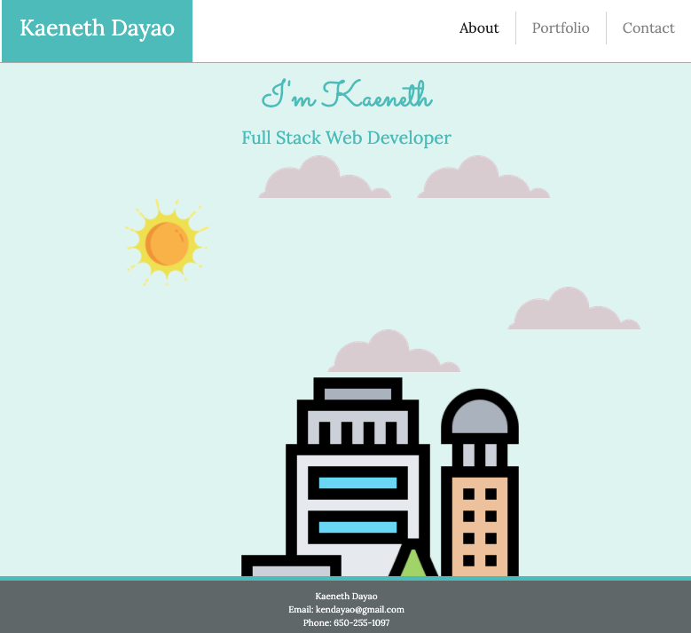

# React-Portfolio

## Description

This is my web development portfolio. This portfolio showcases my web development skills through projects that I have worked on myself and projects that I have worked on with a team.

## Table of Contents

* [Description](#description)
* [Technology](#technology)
* [User Story](#user-story)
* [Installation](#installation)
* [Usage](#usage)
* [License](#license)
* [Contributing](#contributing)
* [Tests](#tests)
* [Questions](#questions)
* [Deployed Application URL](#deployed-application-URL)

## Technology
- React
- HTML
- CSS 
- Boostrap
- JavaScript
- Express
- Node
- MongoDB

## User Story

As a developer, I want a portfolio to display my coding projects so other developers can learn about me and view my projects.

## Installation

No installation needed. If cloning repo do an npm install.

## Usage

The deployed application link will take you to the homepage. From the homepage, you can use the navbar to navigate to the portfolio and contact page.

## License

## Contributing

Please follow standard contributing guidelines.

## Tests

No tests to run.

## Questions

For any questions, please contact kendayao at kendayao@gmail.com

## Deployed Application URL

Deployed application link: https://kaenethdayao.herokuapp.com/

